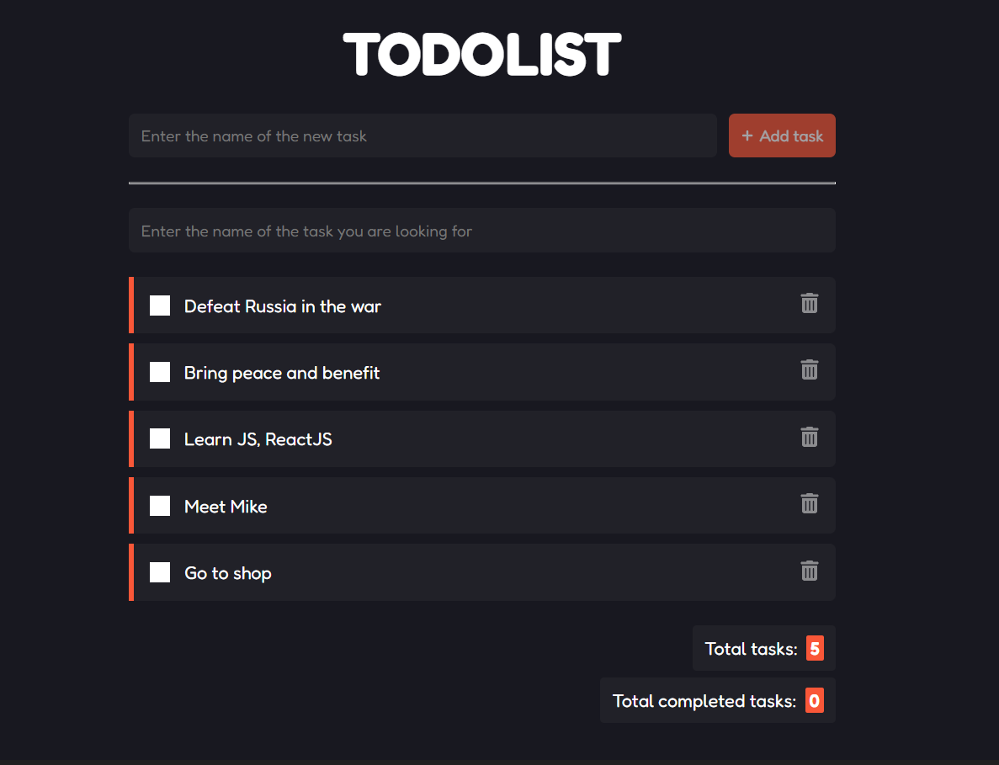

<h1 align="center">
  Todolist
</h1>




## Project

This is a list of tasks created with the [ReactJS library](https://pt-br.reactjs.org/), containing the following functions:

- [x] Add a new task
- [x] Delete task
- [x] Search task
- [x] Mark a task as completed
- [x] Created task counter
- [x] Completed tasks counter

## How to run

You will need to clone the project

```bash
$ git clone https://github.com/CerusRebus/react-todolist 
```

Install dependencies and run init script


```bash
$ npm i

$ npm run dev
```